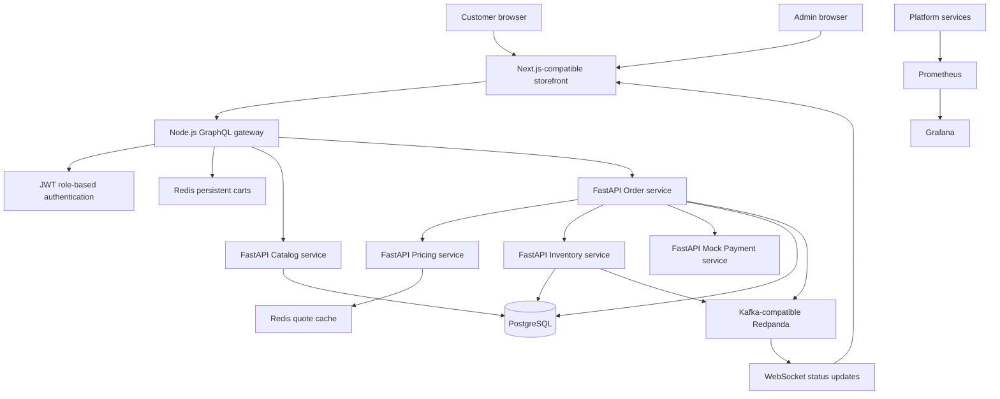
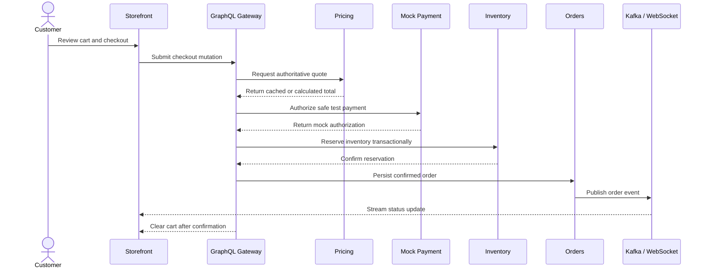

# Meridian Commerce Platform

> A portfolio-grade, event-driven commerce system built to demonstrate modern full-stack development, distributed service design, cloud infrastructure, and production-minded engineering practices.

> [!IMPORTANT]
> **This is a personal project, not a real shopping website.** Products, accounts, payments, and orders are demonstration data only. The payment service is a safe mock and never accepts real card information.

## What Meridian demonstrates

Meridian implements a complete commerce journey instead of a static storefront. Customers can authenticate, browse a GraphQL-backed catalog, manage a persistent cart, adjust quantities, check out through a safe payment simulation, and follow order progress in real time. Administrators have a separate role for creating products, managing inventory, and restocking items; admin accounts cannot shop or check out.

### Core capabilities

- GraphQL-backed product catalog with authoritative pricing and inventory
- Role-based customer and administrator authentication
- Redis-backed carts with live quantity and total updates
- Transactional checkout with inventory reservation and mock payment authorization
- Kafka-compatible events for asynchronous order processing
- WebSocket order-status updates
- Admin product creation, inventory management, and restocking
- Prometheus metrics and Grafana dashboards
- Dockerized local development and automated end-to-end validation
- Kubernetes manifests, AWS EKS Terraform, and GitHub Actions CI/CD templates

## System architecture



### Checkout workflow



## Technology stack

| Layer                        | Technologies                                                     |
| ---------------------------- | ---------------------------------------------------------------- |
| Storefront                   | React 19, TypeScript, Next.js-compatible Vinext, Vite            |
| API gateway                  | Node.js, Apollo GraphQL, JWT                                     |
| Domain services              | Python 3.12, FastAPI                                             |
| Data and cache               | PostgreSQL, Redis, Drizzle ORM                                   |
| Messaging and realtime       | Kafka-compatible Redpanda, WebSockets                            |
| Containers and orchestration | Docker Compose, Kubernetes, Kustomize                            |
| Cloud infrastructure         | AWS EKS, Terraform                                               |
| Delivery                     | GitHub Actions CI/CD                                             |
| Observability                | Prometheus, Grafana                                              |
| Quality                      | ESLint, Prettier, Ruff, Node test runner, end-to-end shell tests |

## Run locally

### Prerequisites

- Docker with Docker Compose
- Node.js 22.13 or newer
- npm

### Start the platform

```bash
git clone https://github.com/Ghostmaster-Ui/Distributed-commerce-.git
cd Distributed-commerce-
docker compose up --build --wait
npm install
npm run dev
```

Open the storefront URL printed by the development server, normally `http://localhost:3001`.

### Local services

| Surface                       | URL                          |
| ----------------------------- | ---------------------------- |
| Storefront                    | `http://localhost:3001`      |
| GraphQL gateway               | `http://localhost:4000`      |
| Catalog API docs              | `http://localhost:8000/docs` |
| Pricing API docs              | `http://localhost:8001/docs` |
| Inventory API docs            | `http://localhost:8002/docs` |
| Order API docs and WebSockets | `http://localhost:8003/docs` |
| Mock payment API docs         | `http://localhost:8004/docs` |
| Prometheus                    | `http://localhost:9090`      |
| Grafana                       | `http://localhost:3002`      |

### Demo accounts

| Role          | Email                     | Password      | Permissions                          |
| ------------- | ------------------------- | ------------- | ------------------------------------ |
| Customer      | `customer@meridian.local` | `meridian123` | Browse, manage cart, and check out   |
| Administrator | `admin@meridian.local`    | `admin123`    | Create products and manage inventory |

These credentials are intentionally public and are suitable only for local demonstration.

## Quality and testing

Run the complete local quality gate:

```bash
bash scripts/quality.sh
```

Or run individual checks:

```bash
npm run format:check
npm run lint
npm run build
(cd gateway && npm test)
bash tests/e2e-commerce.sh
```

The end-to-end test validates the customer login, persistent cart, checkout, inventory reservation, and order-processing path against the running services.

## Project structure

```text
app/                 Storefront, UI components, and typed GraphQL client
gateway/             Apollo GraphQL gateway, authentication, and cart store
services/            Catalog, pricing, inventory, order, and payment services
db/ and drizzle/     Application schema and database migrations
k8s/                 Kubernetes and Kustomize deployment resources
infra/terraform/     AWS EKS infrastructure templates
monitoring/          Prometheus and Grafana configuration
tests/               Rendered-page and end-to-end tests
docs/                Architecture, security, deployment, and Agile guidance
.github/              CI/CD, issue forms, and pull-request template
```

## Engineering workflow

The project uses a lightweight Agile workflow with prioritized backlog items, small reviewable changes, a documented Definition of Ready, and a Definition of Done that requires tests, documentation, observability, and security review where applicable.

- [Agile delivery guide](docs/AGILE.md)
- [Contributing guide](CONTRIBUTING.md)
- [Architecture decision record](docs/adr/0001-domain-service-boundaries.md)

## Deployment and operations

- [Architecture](docs/ARCHITECTURE.md)
- [Deployment guide](docs/DEPLOYMENT.md)
- [Security guide](docs/SECURITY.md)
- [Observability guide](docs/OBSERVABILITY.md)

> [!WARNING]
> The Terraform resources in `infra/terraform` are infrastructure templates. Applying them can create billable AWS resources. Review the Terraform plan, secrets, IAM permissions, networking, production database strategy, and deployment checklist before use.

## License and portfolio use

This repository is presented as a personal engineering project. Before adapting it for a production commerce system, replace all demo credentials and secrets, integrate a compliant hosted payment provider, add a transactional outbox, perform threat modeling, and complete operational readiness testing.
